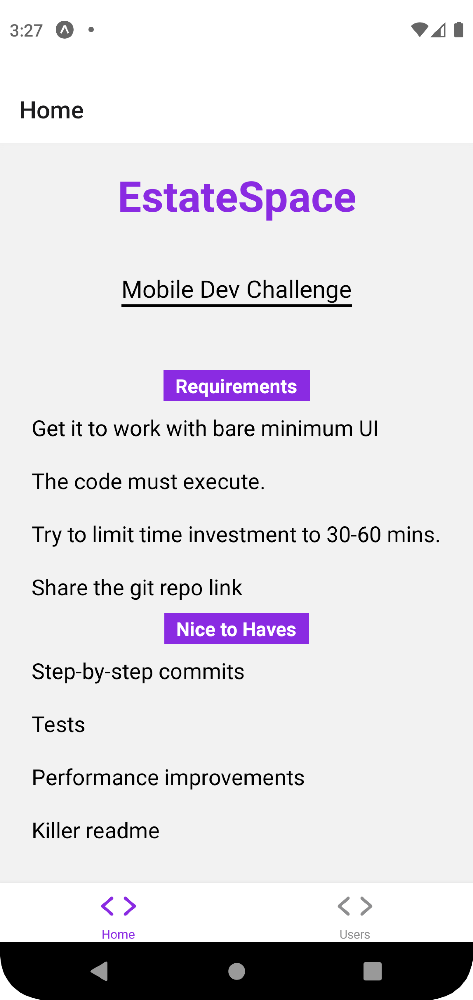
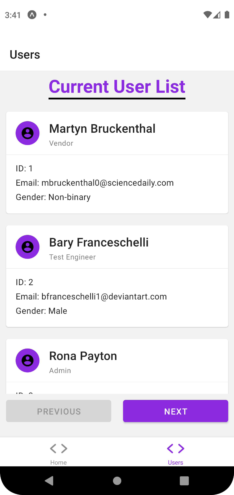

# EstateSpace Mobile Development Challenge

## Table of contents
- [EstateSpace Mobile Development Challenge](#estatespace-mobile-development-challenge)
  - [Table of contents](#table-of-contents)
  - [General info](#general-info)
  - [Technologies](#technologies)
  - [Setup](#setup)
  - [Screenshots](#screenshots)
    - [Home Screen](#home-screen)
    - [User Page](#user-page)

## General info
This Challenge was to perform a API request and display the information on a React Native platform.

[API Information](https://github.com/GriffinGroupGlobal/mobile-challenge/blob/master/user.md)
	
## Technologies
Project is created with:
* React Native
* API / Fetch
* Expo
* JavaScript
* CSS
* Jest
* Node / NPM
	
## Setup
To run this project:

```
Run: git clone https://github.com/ParkerM2/mobile-challenge.git
Install node modules: npm install
To run use: npm start or expo start
```
## Screenshots

### Home Screen


### User Page


